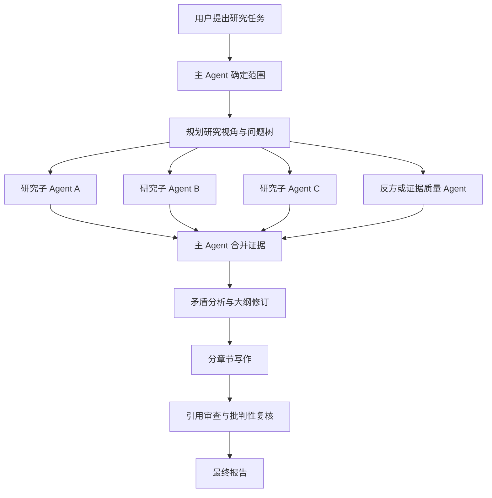

# Storm Research

把斯坦福 STORM / Co-STORM 的“多视角提问、检索、证据整理与长文写作”方法，改造成可在 Claude Code、Codex 等 Agent 软件中复用的多 Agent Research Skill。

> 本项目是基于 STORM 研究方法制作的非官方 Agent Skill，并非斯坦福大学或 STORM 团队发布的官方实现。

## 它能做什么

普通 AI 写作通常是“给出题目，直接生成文章”。`storm-research` 会先组织研究，再开始写作：

- 根据主题生成不同研究视角和递进式问题树；
- 调度多个子 Agent 独立检索和分析资料；
- 汇总来源、证据、冲突与研究缺口；
- 根据证据修订大纲，而不是先定结构再填内容；
- 分章节写作，并执行引用审查和批判性复核；
- 保留研究过程，方便中断续跑和结果追溯。

适合文献综述、行业调研、技术报告、争议问题分析、引用审计，以及基于本地资料的深度写作。

## 工作方式



多个子 Agent 可以并行研究，但全局证据台账、编号和最终合并始终由主 Agent 管理。多个 Agent 得出相同结论也不等于证据，最终判断仍须落到真实来源。

## 主要特点

- **斯坦福 STORM 思路**：保留多视角提问、模拟追问、证据驱动大纲和分节写作。
- **多 Agent 协作**：不同研究角色拥有相对独立的上下文，减少单一视角偏差。
- **平台无关**：不写死某一家软件的工具名称，可适配 child agent、subagent、task worker 或 agent team。
- **本地与联网兼容**：支持只读本地文件、本地优先补充联网资料，以及联网优先研究。
- **证据可追溯**：记录来源、定位信息、原子结论、冲突和不确定性。
- **引用审查**：检查引用是否真正支持相邻结论，而不只是“文章里有参考文献”。
- **可降级运行**：宿主不支持子 Agent 时，可由主 Agent 按角色顺序执行。
- **无需外部 LLM API**：直接使用宿主 Agent 的原生推理能力。

## 目录结构

```text
storm-research/
├── SKILL.md
├── README.md
├── references/
│   ├── artifacts.md
│   ├── platform-adapters.md
│   ├── roles.md
│   └── source-mapping.md
└── scripts/
    ├── finalize_citations.py
    └── validate_run.py
```

安装时请复制整个 `storm-research` 文件夹，不要只复制 `SKILL.md`。

## 下载

- GitHub：当前仓库，可通过 **Code → Download ZIP** 下载。
- 百度网盘：`【待补充】`
- 提取码：`【待补充】`

## 安装

### Claude Code

项目级安装：

```text
<项目目录>/.claude/skills/storm-research/
```

个人级安装：

```text
~/.claude/skills/storm-research/
```

Windows 上通常对应：

```text
C:\Users\你的用户名\.claude\skills\storm-research\
```

重新打开 Claude Code 后，可以显式调用：

```text
/storm-research
```

### Codex

复制到已配置的 Codex Skills 目录：

```text
$CODEX_HOME/skills/storm-research/
```

未单独配置 `CODEX_HOME` 时，Windows 上常见的个人目录为：

```text
C:\Users\你的用户名\.codex\skills\storm-research\
```

重新打开 Codex 后，可以显式调用：

```text
$storm-research
```

### 其他 Agent 软件

如果软件支持 Agent Skills 目录结构，通常可以原样复制到其 Skills 目录。

如果宿主使用其他扩展格式：

1. 将 `SKILL.md` 作为主工作流；
2. 将 `references/` 作为按需加载的参考资料；
3. 将 `scripts/` 作为可选检查工具；
4. 将文件读取、资料检索、子 Agent、结果等待和文件保存映射到宿主的对应能力。

## 快速开始

安装完成后，可以直接输入：

```text
使用 storm-research，以 standard + hybrid 模式，
研究“AI Agent 在科研工作流中的应用”。
请生成多个研究视角，调用多个子 Agent 分别研究，
汇总证据与冲突后修订大纲，最后输出带来源的中文报告。
```

### 只研究本地资料

```text
使用 storm-research，以 standard + local-only 模式，
研究当前目录中的论文和 Markdown 资料。
不要联网，不要用模型记忆补充事实。
输出问题树、证据台账、矛盾图和中文综述。
```

### 严格文献综述

```text
使用 storm-research，以 rigorous + hybrid 模式，
研究机器学习势函数在电解液分子动力学中的应用。
优先读取当前目录论文，再补充同行评议文献。
比较训练数据、精度、计算成本、适用边界和外推风险，
输出证据表、矛盾图、引用审查和中文综述。
```

### 让用户参与研究方向

```text
使用 storm-research，以 standard + interactive + hybrid 模式研究指定主题。
生成研究视角后先让我确认，大纲完成后再次暂停。
```

## 研究深度

| 模式 | 适合场景 | 主要行为 |
|---|---|---|
| `quick` | 快速了解陌生主题 | 3 个视角、一次研究、简短矛盾分析与审查 |
| `standard` | 常规深度报告 | 3–5 个视角、一次追问、修订大纲、引用审查与批判性复核 |
| `rigorous` | 文献综述或高风险任务 | 5–8 个视角、明确检索策略、迭代检索和独立审查 |

默认使用 `standard`。

## 资料模式

| 模式 | 资料范围 |
|---|---|
| `local-only` | 只使用用户指定的本地文件 |
| `hybrid` | 先检查本地资料，再检索缺失的外部来源 |
| `web-first` | 以当前网络资料为主，本地材料为辅 |
| `interactive` | 在指定的范围、视角或大纲节点等待用户确认 |

默认使用 `hybrid`。如果任务禁止联网，必须选择 `local-only`。

## 研究产物

长任务默认在当前工作区创建：

```text
.storm-research/<topic>/
├── 00-scope.md
├── 01-personas.md
├── 02-question-tree.md
├── research/
├── 03-evidence-ledger.md
├── 04-contradiction-map.md
├── 05-outline.md
├── draft/
├── 06-citation-audit.md
├── 07-critical-review.md
└── report.md
```

具体文件数量会随研究深度变化。`quick` 模式可能合并部分中间文件，`rigorous` 模式会保留更完整的检索和审查记录。

## 可选 Python 工具

两个脚本均使用 Python 3.9+ 标准库，不需要安装第三方依赖。

检查运行目录中的来源、证据和引用关系：

```bash
python scripts/validate_run.py <run-directory>
```

将正文中的 `[@E001]` 证据占位符转换为稳定的数字引用：

```bash
python scripts/finalize_citations.py \
  <draft.md> \
  <03-evidence-ledger.md> \
  <report.md> \
  --map <citation-map.json>
```

Python 不可用时，Agent 仍可运行核心研究流程，但需要手动检查引用映射。

## 使用边界

这个 Skill 不能自动保证研究质量。使用时仍需注意：

- 不把模型记忆当作证据；
- 不编造引用、元数据、页码、样本量或实验结果；
- 不因为多个 Agent 意见一致就判定结论正确；
- 不把作者解释写成整个领域的共识；
- 不因为当前检索结果较少就宣称存在研究空白；
- 不隐藏相互冲突的证据和无法解决的不确定性；
- 不因为文章带有引用就声称达到发表标准。

## 方法来源

本 Skill 借鉴斯坦福 STORM 和 Co-STORM 的研究架构，保留其多视角提问、检索驱动追问、证据整理、大纲修订和分章节写作等核心思路，并用宿主 Agent 原生的多 Agent 能力替代原项目中的外部模型调用。

- STORM 项目：<https://github.com/stanford-oval/storm>
- STORM 在线项目页：<https://storm-project.stanford.edu/>

本仓库不包含或替代 STORM 官方项目。需要运行原版 STORM 时，请参考其官方仓库。
